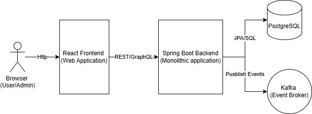

# Media Tracker
Track all the media you have experienced, or want to experience, in one place.  
Currently supported media types: Movies, TV Series, and Video Games.

## Overview
This application allows users to maintain a personal list of media they want to track.  
Each item in a user’s list may include: 
* Experienced: Whether the media item has been viewed or played.
* Re-experience: Indicates whether the user would like to experience the item again.
* Rating: The user may rate the item on a scale of 1–10.
* Comment: The user may add a short personal comment.

The application also supports viewing other users’ lists and following other users.  
Users can search for other users:
* By name
* By sorting the default user list by registration date, last active date, number of ratings, or number of followers
* By filtering by role (Admin or User)
* Advanced search: Select up to five media items and a rating range for each.  
  The search returns users who rated those items within the specified ranges.

Following a user allows:
* Easily access followed users from the Follow section.
* Receive notifications when a followed user rates an item above a configured threshold.

If a user has the Admin role, they gain the following additional capabilities:
* Create and update media items individually or via CSV upload.
* Admin users are clearly identified as such when viewed by other users.
* Comments are visible when viewing an Admin’s list (comments are hidden by default for regular users).

## Quick Start (Run with Docker)
This project is fully containerized.
You do not need to install Java, Node.js, PostgreSQL, Kafka, or any other dependency on your machine.

The only requirement is Docker.

### Prerequisites
Docker must be installed on your system.

Windows / macOS - Download and install Docker Desktop from:
https://www.docker.com/products/docker-desktop/

Linux - Follow the official instructions for your distribution:
https://docs.docker.com/engine/install/

After installation, make sure Docker is running.  
You can verify Docker is installed by running:
```bash
docker --version
docker compose version
```
If both commands print a version, you are ready.

#### Step 1: Clone the repository
Run the following commands in the directory where you want to place the project:
```bash
git clone https://github.com/amirtwilc/MediaTracker.git
cd MediaTracker
```

#### Step 2: Start the entire application
From the root of the project, run:
```bash
docker compose up --build
```
This may take several minutes the first time because Docker needs to download dependencies.

#### Step 3: Wait until everything is ready
When the startup is complete, you should see logs indicating that:
* PostgreSQL is running
* Kafka is running (ZooKeeper and Kafka services)
* Backend started successfully
* Frontend is being served

You should also see "mediatracker" under Docker Desktop's Container's tab. 
Check that all components have started. If one or more components have failed to start, you may try to start it again via the UI. 
If still does not start, check the logs to identify the problem.

#### Step 4: Access the application
Frontend (Web UI):
http://localhost:3000

Backend API:
http://localhost:8080

#### Step 5: Login/Register to the app
In order to login as an Admin, enter these values:  
User: Admin  
Password: 123456  
Note: These credentials are for local development only.  

Admins may Create and update items in the app.  
Alternatively, register a new user to the app. 

#### Step 6: Initialize items in database
The "Search Media" tab will not display any items at this stage. 
For this step, you must be logged as an Admin.  
Go to "Admin Panel" tab -> Upload CSV -> Choose file -> Choose file from root of this project, named: "media_tracker_sample.csv" -> Click Upload CSV  
Once the process is finished, items will appear at "Search Media" tab, and the app is ready for use.
You may also upload your own CSV file, either instead of the sample file or in addition to it at a later stage. Both approaches are fully supported.

#### Stopping the application

To stop everything, press: CTRL + C  
Then cleanly shut down containers with:
```bash
docker compose down
```
Your database data is preserved unless you explicitly remove volumes.

#### Troubleshooting

If something goes wrong:

1. Make sure Docker is running
2. Run:
```bash
docker compose down
docker compose up --build
```
3. If ports 3000 or 8080 are already in use, stop the conflicting applications

## Architecture
The project is implemented as a monolith for simplicity and clarity.

### High Level Architecture



* The frontend communicates with the backend via REST APIs.
* The backend handles business logic and persists data in PostgreSQL.
* Kafka is used for asynchronous events such as user notifications.
* All services are orchestrated locally using Docker Compose.

## Core Motivation
This project is meant to demonstrate my ability to design and build applications.
It is also a great foundation and reason for me to learn new technologies, AI tools, and software principals that I wish to learn.
As a result, some features intentionally prioritize learning and experimentation over production-optimal approaches.
In the next paragraphs I will try to explain my rationale for the main components and technologies used in this project.

## What This Project Demonstrates

* System design: Designing a full-stack application with clear domain boundaries, role-based behavior (users vs. admins), and well-defined responsibilities across backend, database, messaging, and frontend layers.
* Data modeling: Modeling relational data for users, media items, ratings, followers, and notifications, including consideration of relationships, constraints, and future extensibility.
* Dockerized environments: Running the entire system locally using Docker Compose, enabling consistent setup of the backend, frontend, database, and messaging infrastructure without manual dependency installation.
* Tradeoff analysis: Making intentional design choices (e.g., monolithic architecture, CSV-based ingestion, Kafka usage) and explicitly documenting their benefits, limitations, and possible alternatives.
* Learning and adaptation: Integrating and working with technologies outside my primary expertise (e.g., React, PostreSQL, GraphQL) and using the project as a structured learning platform.

### Technologies

* Backend: Java (Spring Boot)  
  This is where my experience lies. The main goal of this project is to demonstrate my Java Spring knowledge and expertise.

* Database: PostgreSQL  
  Mainly picked for get-to-know purposes. I also believe relational database is a good decision here.

* Message Queue: Kafka  
  Picked because of my strong experience and is an important technology to demonstrate knowledge of.

* API paradigm: REST and GraphQL
  The backend primarily exposes REST endpoints, which fit the project’s requirements for full-resource responses.  
  GraphQL was also integrated experimentally (via UserQuery and UserMutation classes) to explore its usage and compare approaches.

* Frontend: React  
  React was used to provide a modern, interactive UI. While frontend development was not the primary focus of this project, it allowed me to effectively showcase backend capabilities and overall system design.

* AI tools: Claude, ChatGPT, Cursor, Windsurf  
  AI tools were used as productivity and learning accelerators, not as a replacement for architectural decision-making or code review.

### Core decisions

#### Saving Items Via CSV Uploading
The app allows admins to create a CSV file, following specific structure and uploading it. Doing so registers items to the DB in a bulk, rather than one-by-one. \
The only real reason for this approach is that I really wanted to integrate Spring Batch in one way or another. \
I don't believe this is the best approach for this particular problem. \
Disadvantages: 
* Admins must always create manual CSV files, maintaining new movies/TV shows/Games at all times. Also, platforms keep changing and must be updated
* Admins might make mistakes, typos etc.

Possible better solution:
* There are already global APIs with huge databases, which could be easily queried and saved directly and automatically to the app's database.

#### Platform inconsistency
One of the fun features I wanted to add was the option to filter by platform (Netflix, Disney+, etc.). \
So if a user says "I have Netflix, what can I watch?", then this app could help decide. \
The problem is that each streaming service usually has different libraries based on one's current region. \
Currently, the app does not support, nor have the ability, to differentiate between different regions. \
Possible solutions:
* - Assuming there are global APIs that has this information for all regions, this is probably the easiest approach.
  - Since medias sometimes have expiration time until they are unavailable at current streaming service, APIs would be required to be fetched regularly or expiration dates will have to be maintained
  - Each item will hold a ManyToMany relationship to region, as well as platform.
  - Users will declare what is their region to filter unrelated regions.
* Each user will manage its own "region". Platforms will remain as is today, where each item displays ALL known platforms, 
regardless of region, and users will have the option to mark each item as "Not available to me". They will need the option to cancel mark as well.

#### Items might be missing
Even with the most reliable approach to maintain up-to-date items at all times, some items are destined to be missing (That one show from that one country, which a user really wanted to track). 
Users might want the ability to suggest items, or at least maintain their own items. 

Things to consider:

- Need to decide how notifications would be handled on these rated items: Would followers still be interested in these less known items?
- Ability to suggest means Admins needs to review and approve, but over-using this feature means a lot of work that is piling up. 
- Maintaining own items means users might add garbage items or add items that are already available.

The solution for both latter cases is probably to limit the new items allowed to suggest/save at each X days.

## Next Steps

* Security and authentication improvements (e.g., password recovery and account management)
* Observability: Enhance logging, introduce distributed tracing, and add monitoring dashboards
* Allow users to export their own lists to a file (e.g., CSV or JSON)
* Improve media ingestion by creating and fetching items via global public APIs
* Add media posters using external APIs, fetching assets dynamically instead of storing them locally, with graceful fallback if retrieval fails
* Improve platform availability accuracy by resolving platform differences based on user region
* Allow users to suggest new items, potentially via a centralized suggestion area where the community can review and vote
* Testing: Maintain and expand test coverage, enhance integration tests, and introduce load and stress testing
* Scalability improvements: Introduce caching, optimize database queries, and evaluate a potential transition to a microservices architecture
* Deploy the application to a publicly accessible environment

## Author

Developed by Amir Twil-Cohen as a personal project to explore system design, backend architecture, and full-stack integration.

